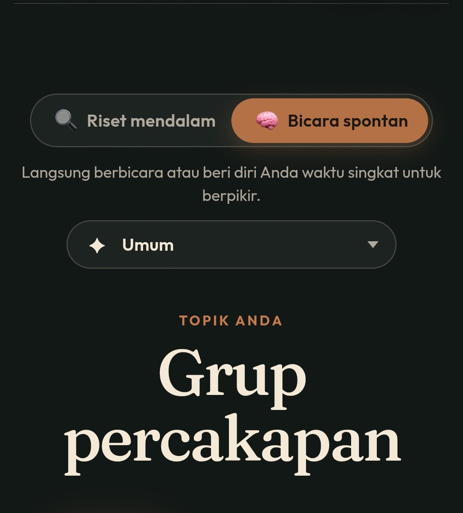

+++
date = '2026-10-02T05:29:17Z'
draft = false
title = 'Grup Percakapan'
url = "grup-percakapan"
+++

 <small>
<i>unprompted.top</i>
</small>

Grup percakapan, ini grup percakapan chatting atau sirkel sirkelan itu ya?

Kalo grup chatting mungkin setiap orang pasti punya grup tersebut, yg ramainya pada hari-hari tertentu wkwk.

Grup yg isinya cuma agenda agenda saja.

Kalo grup semacam sirkel yg kalau kumpul ngomongin orang yg ga ada di grup itu, atau yg memusuhi sirkel lain wkwk.

Kalo saya termasuk orang yg ga masuk dan ga suka sirkel sirkel tersebut, saya lebih suka masuk kemana aja bisa, dekat dg kelompok² mana bisa, ga ada canggung atau gimana.

Berkelompok kurang menarik bagiku, saya lebih suka satu dua orang, ga terlalu ramai dan terlalu mencolok.