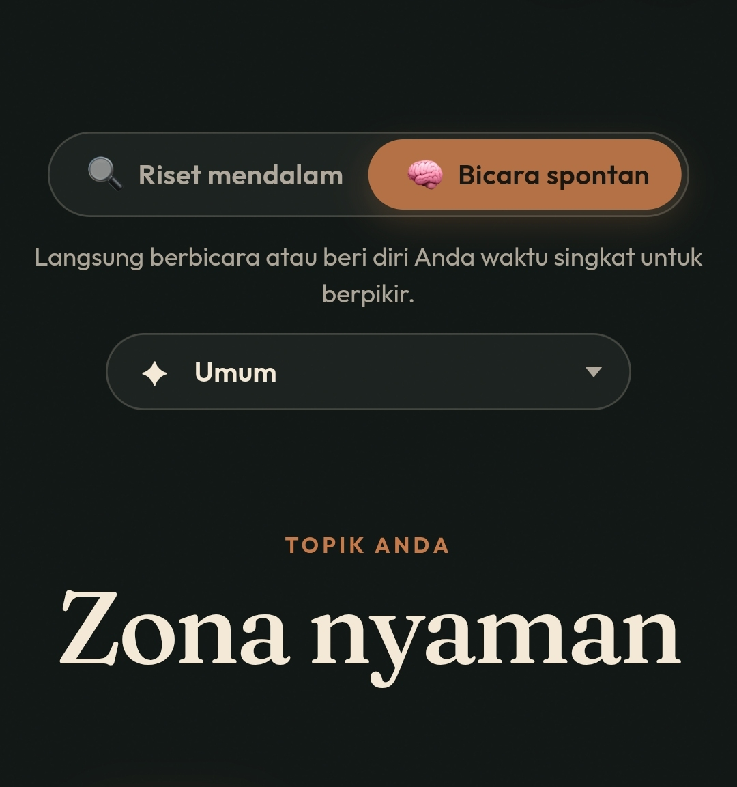

+++
date = '2026-10-01T05:28:56Z'
draft = false
title = 'Zona Nyaman'
url = "zona-nyaman"
+++

 <small>
<i>unprompted.top</i>
</small>

Zona nyaman, pasti kita udah tidak asing dengan kata itu.

Itu adalah sebuah judul lagu dari Fourtwnty, lagu yg hampir di dengarkan setiap orang di jamannya atau bahkan sampai sekarang juga.

Zona nyaman adalah sebuah keadaan dimana kita benar-benar merasa tidak ada tekanan sama sekali, tidak takut kehilangan apapun atau mencemaskan apapun.

Saya dulu sering dengar orang-orang bilang "keluar dari zona nyaman" gitu, kalo udah nyaman ngapain keluar, toh kalo kita keluar dari zona nyaman pasti kita akan ada di zona nyaman itu lagi, atau misal kita udah di tempat yg kita sebut zona nyaman kita keluar atau pindah, kemudian setelah itu di zona nyaman lagi pindah lagi gitu, apa tidak cafek begitu terus.

Dan bukankah kita sebenernya emang mencari zona nyaman, kok malah disuruh keluar 😄.

Kalo menurutku bukan keluar tapi perlebar, perlebar zona nyaman itu supaya kita terus berkembang dan terus belajar, tidak berhenti di suatu titik, kalo misal udah nyaman di kondisi sekarang coba belajar hal baru yg kita ngiranya tidak bisa padahal kalo kita mau terus belajar dan konsisten pasti bisa.

Kadang kita takut buat memulai sesuatu hal yg belum pernah kita mulai sama sekali, kita udah kalah sama pikiran kita, padahal kita belum melakukan apapun tapi udah nyerah begitu aja.

Selagi kegiatan atau hal yg dijalani tidak merugikan orang lain dan tidak melanggar hukum lakukan aja, selama itu baik bagi diri kita.